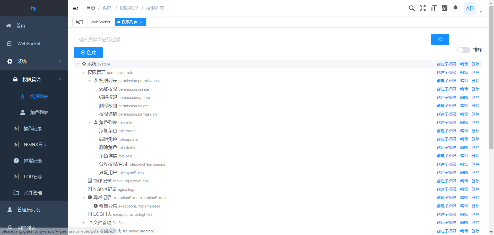
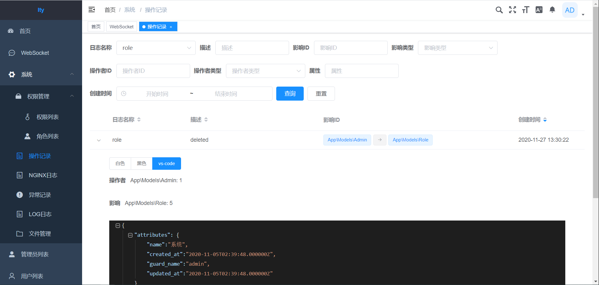
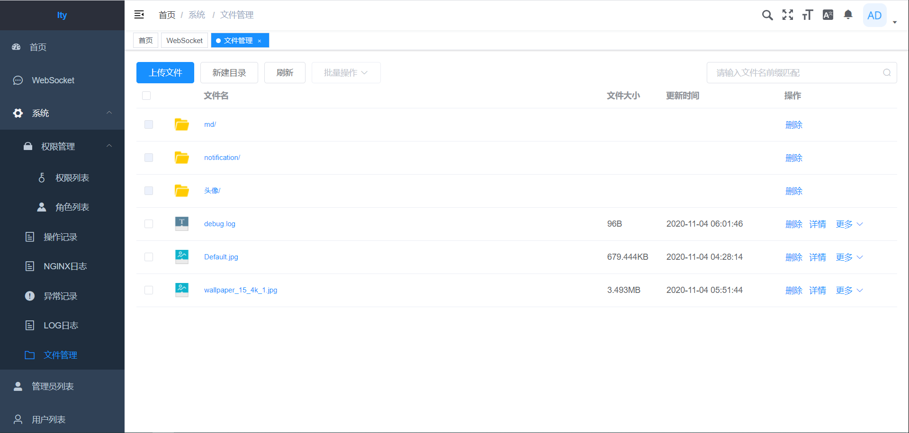
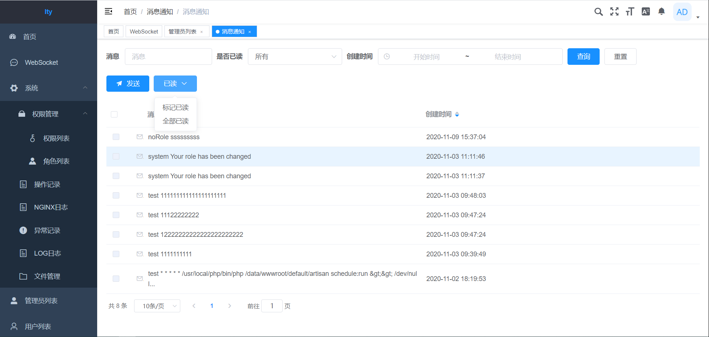
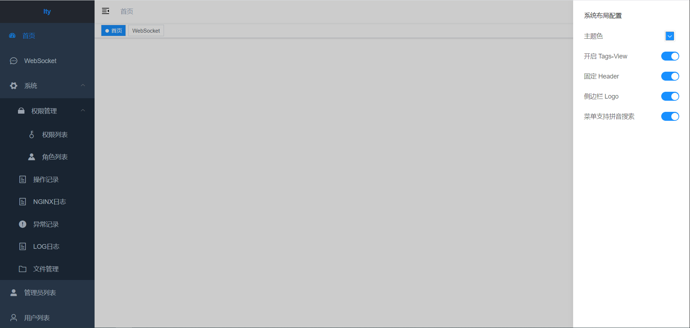
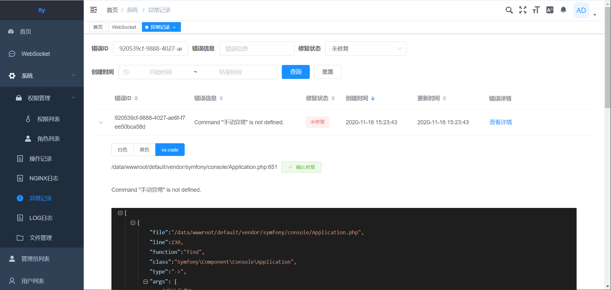
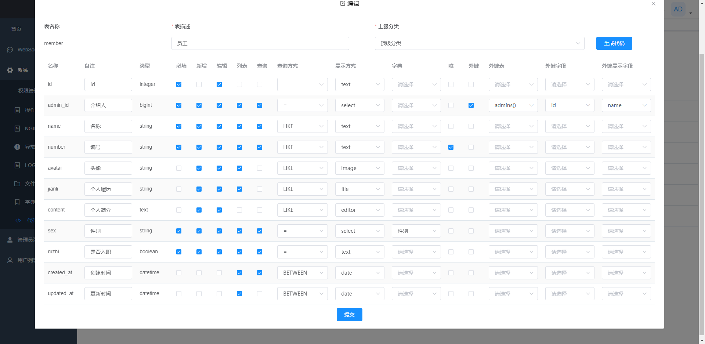

<h1 align="center">ITY</h1>
基于laravel+vue的基础后台, 前后端分离, 欢迎fork&start&pull requests

## DEMO
[https://ityphp.newbanri.com/](https://ityphp.newbanri.com/)

账号 look 密码 123456

## PHP
[https://gitee.com/pleaseyang/Ity](https://gitee.com/pleaseyang/Ity)

[https://github.com/pleaseyang/Ity](https://github.com/pleaseyang/Ity)

## VUE
[https://gitee.com/pleaseyang/ItyWeb](https://gitee.com/pleaseyang/ItyWeb)

[https://github.com/pleaseyang/ItyWeb](https://github.com/pleaseyang/ItyWeb)

## 功能模块
### RBAC权限

整合 [laravel-permission](https://spatie.be/docs/laravel-permission/v3/introduction) 制作的权限角色, 管理员可绑定角色, 也可以单独设置权限

### 操作记录

整合 [laravel-activitylog](https://spatie.be/docs/laravel-activitylog/v3/introduction) 制作的操作记录, 可查看修改前后的JSON

### 文件管理

仿照 阿里云OSS 界面, 制作的文件管理页面

### 站内信

LARAVEL Notifiable Trait 搭建

### 系统布局

[vue-element-admin](https://github.com/PanJiaChen/vue-element-admin) 提供的功能, 二次修改

### 系统异常

获取异常后记录到DB中

### 代码生成器
新增代码生成器(测试版)。可进行CURD，加快开发效率。

 
## 搭建
### 安装
1. `npm install`
2. `npm run dev`

### 部署
1. `npm run build:prod`

### 备注
1. 后端无system接口请使用`no-config`分支

## 致谢
* [jetbrains](https://www.jetbrains.com) 
* [vue-element-admin](https://github.com/PanJiaChen/vue-element-admin)
* [tinymce](https://github.com/tinymce)

## 请作者喝咖啡

